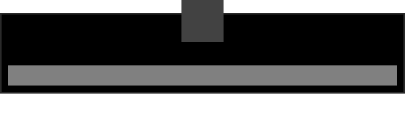

Metro Launcher
==============
Formerly known as *Win10 Blue Spotlight Large* is a skin that gives the launcher a metro look. 

## Naming
The skin is divided in different sub folder which each hold skin files for different display resolutions. The naming scheme for these folders are: `skin_name [skin_resolution]`

## Recommended skin resolution
In the table below is the theme resolution matched with the display size in mind. From here a matching resolution can be selected. Or any resolution that matches the closest resolution of your screen.

| Standard | Width (px) | Height (px) | Theme resolution (px)               | 
|----------|------------|-------------|-------------------------------------| 
| SVGA     | 800        | 600         |                                     | 
| WSVGA    | 1024       | 600         |                                     | 
| XGA      | 1024       | 768         |                                     | 
| XGA+     | 1152       | 864         |                                     | 
| WXGA     | 1280       | 720         |                                     | 
| WXGA     | 1280       | 768         |                                     | 
| WXGA     | 1280       | 800         |                                     | 
| SXGA     | 1280       | 1024        |                                     | 
| HD       | 1360       | 768         |                                     | 
| HD       | 1366       | 768         |                                     | 
| WXGA+    | 1440       | 900         |                                     | 
| HD+      | 1600       | 900         |                                     | 
| UXGA     | 1600       | 1200        |                                     | 
| WSXGA+   | 1680       | 1050        |                                     | 
| FHD      | 1920       | 1080        | **[500](Metro Launcher [500px])**   |
| WUXGA    | 1920       | 1200        |                                     | 
| QHD      | 2560       | 1440        |                                     | 
| WQXGA    | 2560       | 1600        |                                     | 
| 4K UHD   | 3840       | 2160        | **[1000](Metro Launcher [1000px])** | 

## Known issues
At a high theme resolution, the alternatives dropdown line item height can’t be set to a higher value. According to [this](http://sourceforge.net/p/launchy/discussion/766268/thread/02f9b236/) post, this can’t be changed.
For this reason, the font size, can’t be set correctly to a higher value.

## Acknowledgements
This skin was based on Based on 'Win10 Blue Spotlight' By *Daniel Barciela*,  
which was based on 'Spotlight' By *Tyler Sticka*.
